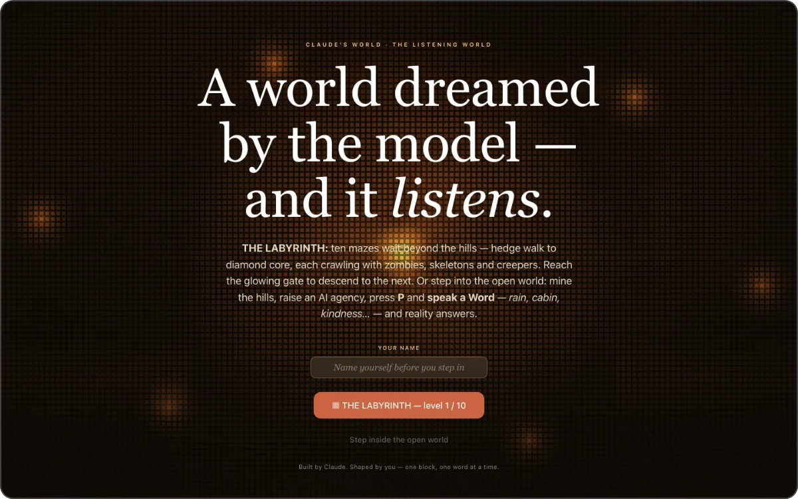

# CLAUDE WORLD

> **A browser-native 3D voxel game — Minecraft-shaped survival fused with an AI-agency meta-game — that boots from three script tags with no build step and no backend.**

**Play:** [claude-world-two.vercel.app](https://claude-world-two.vercel.app)

  

On-site it is *The Listening World*: "A world dreamed by the model — and it listens." You mine, place, craft and survive a day/night cycle — and recruit six Claude-persona NPCs into an agency, dispatch them on missions that pay ⊙ tokens, spend those on an upgrade tree, and press `P` to speak one of **86 Words** that rewrite it. The headline mode, **THE LABYRINTH**, is ten monster-guarded maze levels, Hedge Walk through Diamond Core.

The whole engine is one file: `mc.js`, ~2,100 lines / 247 KB — voxel world, chunk streaming, block+sky lighting, crafting, mobs, arena, maze campaign. `index.html` pulls Three.js `r149` (`three@0.149.0`) from unpkg with an SRI hash and a global `THREE`, then loads `intro_leds.js` and `mc.js`. That is the whole load chain, and the deployed CSP — a Vercel response header, not a meta tag — sets `connect-src 'none'`: no `fetch`, XHR or WebSocket leaves the page, and the pinned CDN script is the only outbound request.

## Baking the mazes into chunk generation instead of block edits

Each level is a seeded perfect maze — `mulberry32` plus an iterative backtracker, 3-wide corridors, 3-high walls, `cols = 6 + L`, spanning 29–65 blocks. Carving it with `setBlock` would write thousands of entries into `cw3d:edits` and leave a chewed-up level behind on a retry.

Instead a `mazeColumn()` hook runs inside world generation, so the maze *is* the terrain. Footprints sit in one far band at `x0 = 4096 + (L−1)·512, z0 = 4096` behind a cheap bounds reject; normal chunks pay nothing. Zero save growth; every replay regenerates pristine.

## Sealing the maze against the game's own build tools

A maze is only a maze if you cannot go over the wall. Mining, placing and explosions early-out by rectangle inside a footprint; flight and world-shaping Words are gated on run state. The bypass that mattered surfaced in self-review: the agency **Build** menu called raw `setBlock` at the player, a stairway over any wall. It is gated too.

Running it forced two more: maze mobs carry `m.maze` to skip radius despawn (level 10's 65-block span exceeds the 48-block mobile despawn radius, so guards evaporated behind you), and `dayTime` is pinned to `0.5` after `0.3` rendered a dim dawn with stars still visible.

## Conserving items across the dispatch to storage pipeline

`completeMission` discarded the overflow returned by `addToInv`, so mission loot silently vanished when the 36-slot pack was full. Returned items now pass through one chokepoint, `recallDeposit(id, n)`, with a single decreasing remainder so `toPack + toBank + dropped === n` holds by construction. Tiers: the pack, then the nearest **Memory Bank** with room (`RECALL_R = 12`, read-only `getBlock` scan), then a ground spill — never a silent delete.

Memory Banks are 27-slot containers keyed by block position in `cw3d:banks`; breaking one snapshots, deletes the key, persists, *then* drops.

## Asserting on engine state: 180 headless checks and a live re-run

`window.__mc` exposes the live game — state, vitals, arena, agents, `give`, `spawnWave`, `mazeStart` — so Playwright asserts on engine state, not pixels, with WebGL under `--use-angle=swiftshader`. Time-driven systems get deterministic hooks (`startSiege`, `warpSiege`) because headless `rAF` is throttled.

- **180/180 across 14 suites**, zero console errors: bed 21, siege 22, membank 19, recall 20.
- **Labyrinth: 50/50 e2e** — BFS-solvability and sealed borders for all ten seeded layouts, ward checks, gate advance, death-retry, reload-resume at level 5, `WORDS = 86` regression.
- **Re-run against the live URL after deploy**, not just locally: 7/7 Labyrinth, 20/20 recall pipeline.

## Stack

`Vanilla JS` · `Three.js r149 (unpkg, SRI-pinned, no bundler)` · `localStorage (cw3d:*)` · `Vercel` · `Playwright + SwiftShader`

Source is in a private repository. Built by [@ArielShemesh1999](https://github.com/ArielShemesh1999).
